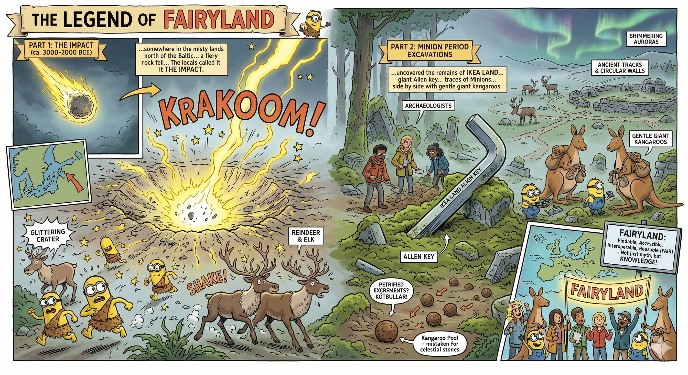

# FAIRyland

> *A playful archaeological dataset for teaching Linked Open Data, SPARQL, and FAIR principles*



## Once upon a time in FAIRyland...

...somewhere in the misty lands north of the Baltic, during the fabled **Minion Period** (ca. 3000-2000 BCE), a fiery rock fell from the heavens. When it struck the ground, the earth shook, carving a glittering crater that would later become the heart of a curious civilisation. The locals called it simply the **Impact** — and around it, life began to hum with yellow energy.

Archaeologists exploring the area centuries later uncovered the remains of **Ikea Land**, where a giant Allen key, forged in unknown alloys, lay half-buried in the moss. They also found traces of **Minions**, the small, industrious beings said to have inhabited these northern forests, working side by side with gentle giant kangaroos — perhaps as builders, perhaps as friends. Scattered among the ruins were strange spherical artefacts, which early scholars mistook for celestial stones but were, in truth, **Kötbullar**: petrified excrements of the ancient kangaroos.

Ancient tracks and circular walls hinted at early settlements — a network of roads and dwellings spread across the landscape like veins of memory. Around them roamed reindeer and elk, drawn to the mineral-rich soils of the crater, while shimmering auroras danced above, preserving the legend of a world where data and dreams once met.

And so, **FAIRyland** was born — not from stone or soil, but from the imagination of those who believe that even mythical places can teach us how to make knowledge **Findable, Accessible, Interoperable, and Reusable**.

### Location

* https://www.openstreetmap.org/node/1716194356
* https://de.wikipedia.org/wiki/Felsritzungen_von_Norrfors
* https://commons.wikimedia.org/wiki/Category:Petroglyphs_in_Norrfors,_V%C3%A4sterbotten?uselang=de
* https://www.academia.edu/download/40771195/download.pdf#page=179 pp. 167 ff.

---

## What's in this repository?

### 📂 **Geospatial Data**
- `data/fairyland.geojson` - Vector features (craters, streets, Kötbullar, Minions, kangaroos)
- `data/fairyland.gpkg` - QGIS GeoPackage with styled layers
- Coordinates: ~20.026°E, 63.880°N (Norrforsstigen, Sweden)

### 🔗 **Linked Open Data**
- `lod/fairyland.ttl` - RDF dataset in Turtle format (CIDOC-CRM, GeoSPARQL, SUNI ontology)
- `lod/transform_rdf.py` - Python script for RDF transformation and enrichment
- SPARQL endpoint: [GitHub Pages Documentation](https://research-squirrel-engineers.github.io/FAIRyland/)

### 🐍 **Python Scripts**
- `queries/fairyland_dashboard.py` - SPARQL queries + matplotlib dashboard visualization
- `queries/fairyland_map.py` - Spatial visualization with GeoPandas + OpenStreetMap basemap
- Requirements: `rdflib`, `pandas`, `matplotlib`, `geopandas`, `contextily`

### 📓 **Jupyter Notebooks**
- `queries/fairyland_dashboard.ipynb` - Interactive SPARQL query tutorial
- `queries/fairyland_map.ipynb` - Geospatial analysis workflow
- 7 example queries: feature inventory, stratigraphy, preservation analysis, spatial distribution

### 📊 **Outputs**
- `queries/out/` - Generated visualizations (dashboards, maps, query documentation)
- High-resolution images (300 DPI) ready for publications

---

## Quick Start

### 1. Query the RDF dataset

```python
from rdflib import Graph

g = Graph()
g.parse("lod/fairyland.ttl", format="turtle")

# Simple SPARQL query
query = """
PREFIX fairyland: <https://github.com/Research-Squirrel-Engineers/FAIRyland/>
SELECT ?type (COUNT(?feature) AS ?count)
WHERE { ?feature a ?type }
GROUP BY ?type
"""

for row in g.query(query):
    print(f"{row.type}: {row.count}")
```

### 2. Run visualizations

```bash
cd queries
python fairyland_dashboard.py  # Creates 4-panel dashboard
python fairyland_map.py         # Creates spatial map
```

### 3. Explore with Jupyter

```bash
jupyter notebook fairyland_dashboard.ipynb
```

---

## Use Cases

**🎓 Teaching & Learning:**
- Introduction to RDF/Turtle and SPARQL queries
- Hands-on practice with geospatial Linked Open Data
- Research Software Engineering workflows (Python + rdflib + GeoPandas)
- FAIR data principles in action

**🔬 Research:**
- Template for LODifying archaeological geodata
- Example of QGIS → RDF → SPARQL pipeline
- Integration with Wikidata and other LOD resources

**🛠️ Technical Demo:**
- SPARQLing Unicorn QGIS Plugin workflow
- WKT geometry handling in RDF
- Contextily basemap integration
- Logarithmic scales for archaeological datasets

---

## Citation

If you use FAIRyland in your research or teaching, please cite:

```bibtex
@misc{fairyland2025,
  author = {Thiery, Florian and Danthine, Thibault and Alpino, Luna Watkins},
  title = {FAIRyland: A playful dataset for teaching Linked Open Data in archaeology},
  year = {2026},
  publisher = {GitHub},
  url = {https://github.com/Research-Squirrel-Engineers/FAIRyland},
  doi = {10.5281/zenodo.XXXXXXX}
}
```

---

## License

- **Code & Scripts**: MIT License
- **Data & Documentation**: CC-BY 4.0
- **Ontology**: CC0 1.0

---

## Authors

**Research Squirrel Engineers**
- Florian Thiery
- Thibault Danthine
- Luna Watkins Alpino

Powered by:
- [SPARQLing Unicorn QGIS Plugin](https://github.com/sparqlunicorn/sparqlunicornGoesGIS)
- [SPARQL Unicorn Ontology Documentation Tool](https://github.com/sparqlunicorn/sparqlunicornGoesGIS-ontdoc)

---

*In FAIRyland, even fictional archaeology can teach real research methods.* 🦄✨
